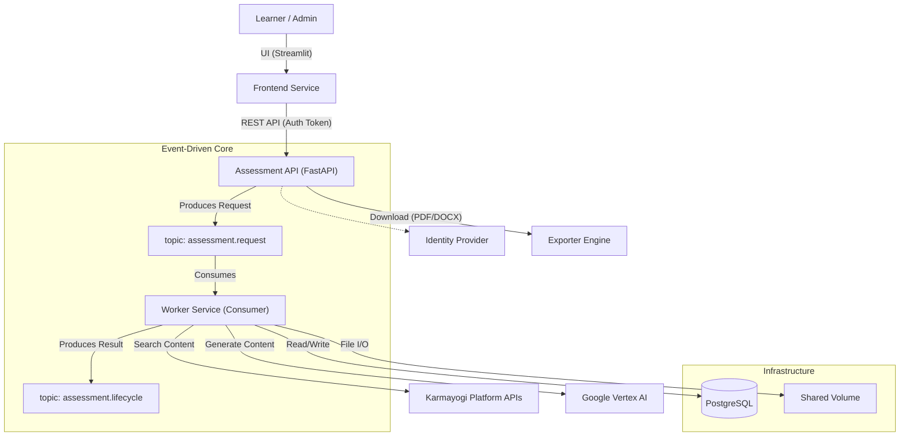
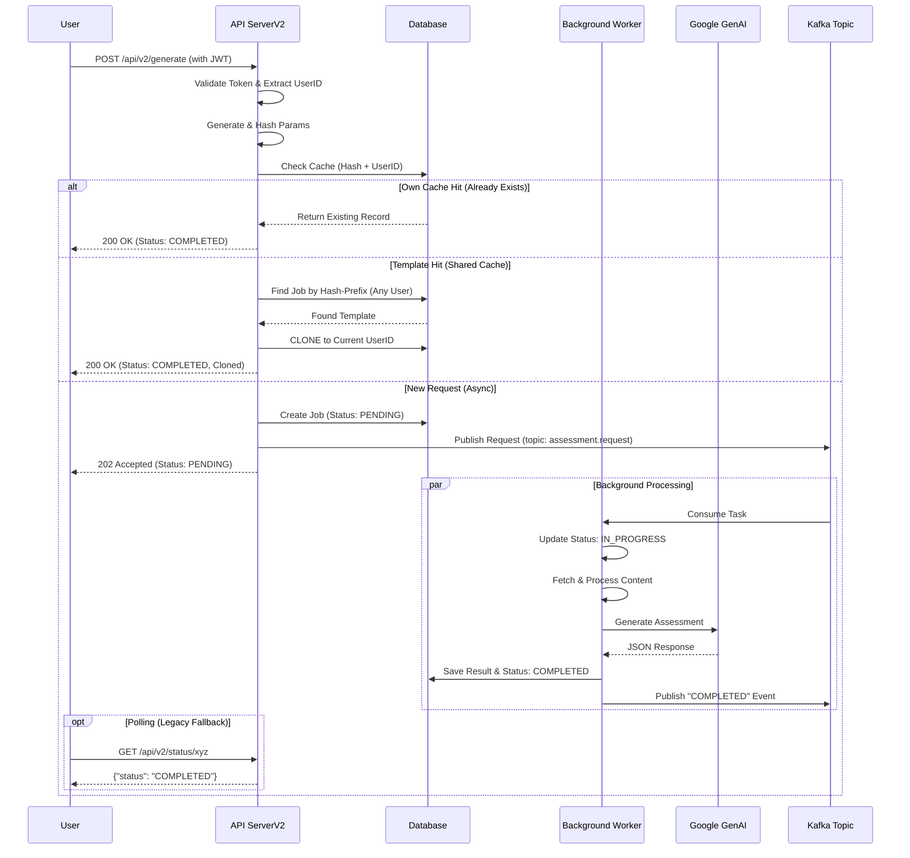
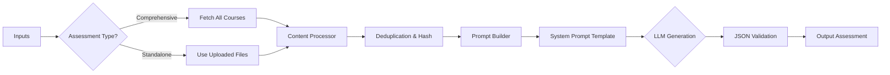

# Assessment Generation Architecture

This document provides a technical overview of the AI-powered Assessment Generation system. It is designed for architectural review and covers system context, data flow, and key logic components.

## 1. System Context

The system operates as a microservice offering a REST API for generating audit-ready assessments from course content (PDFs, Videos/VTTs). It integrates with the Karmayogi Platform for content and Google Vertex AI for generation.



## 2. End-to-End Request Flow (Sequence)

The generation process is asynchronous. The API acknowledges the request immediately, while the heavy lifting happens in the background.



## 3. Core Logic: Generator & Prompting

The core intelligence resides in `src/assessment/generator.py` and `prompts.yaml`.

### 3.1 Content Aggregation Strategy
- **Recursive Fetching**: The system crawls the course hierarchy (deep-search) to find all leaf nodes.
- **Deduplication**: Content hashes (MD5) are used to prevent processing the same PDF or VTT twice (common in multi-language course structures).
- **Text Extraction**:
    - **PDF**: Uses `PyMuPDF` (fitz) for high-fidelity text extraction.
    - **Video**: Fetches `.vtt` subtitles via the Transcoder stats API.

### 3.2 Prompt Engineering (v3.5)
The prompt is dynamically constructed based on the `AssessmentType`:
- **Comprehensive**: Merges context from all course IDs. Logic forces cross-module questions.
- **Standalone**: STRICT scope limitation to provided files only.
- **Bloom's Taxonomy**: The prompt enforces a specific distribution (e.g., 20% Remember, 40% Analyze) to ensure pedagogical depth.

### 3.3 Gemini Context Caching for KCM Competencies
To improve latency and drastically reduce input token costs, the system uses the `google.genai` Context Caching API.
- The 110 detailed Knowledge & Competency Model (KCM) definitions, Behavioral Indicators, and Levels (approx 60k tokens) are stored in `src/assessment/resources/kcm_descriptions.json`.
- On startup or cache expiration, `generator.py` automatically uploads this static dataset to a Gemini Cache.
- During `call_llm()`, the system connects the active Cache ID to the Prompt Generation request, giving the LLM deep competency context for negligible token overhead.



## 4. PDF Generation (WeasyPrint)

The system utilizes **WeasyPrint** for PDF generation to ensure robust rendering of Indian languages and complex scripts.

- **Approach**: HTML + CSS --> PDF.
- **Font Stack**: Noto Sans (Malayalam, Tamil, Devanagari, etc.) is embedded via `@font-face`.
- **Text Shaping**: Uses **Pango** (system library) for correct ligature rendering (unlike ReportLab's limited support).

## 5. Deployment View

Top-level deployment using Docker Compose.

- **API Container**:
    - Python 3.11 Slim
    - Dependencies: `fastapi`, `uvicorn`, `weasyprint`, `google-genai`.
    - System Libs: `libpango-1.0-0`, `libgobject-2.0-0` (for PDF generation).
- **UI Container**:
    - Streamlit (runs on port 8501).
    - Talks to API via internal Docker network (`http://api:8000`).
- **Storage**:
    - `/app/interactive_courses_data`: Shared volume for persistence.

## 6. Data Strategy: Caching & Reuse

The system implements a **Two-Layer Caching Strategy** to minimize external API calls and latency.

### Layer 1: Content Cache (File System)
*   **Goal**: Avoid re-downloading gigabytes of PDF/Video content.
*   **Mechanism**:
    *   Courses are stored in `interactive_courses_data/{course_id}`.
    *   **Logic**: Before fetching, the worker checks if `metadata.json` exists in the target folder.
    *   **Reuse**: If found, the download phase is **skipped entirely**, and the system reuses the local files.
    *   **Structure**:
        ```text
        /app/interactive_courses_data/
        ├── do_1139... (Course A)
        │   ├── metadata.json
        │   ├── module_1/
        │   │   ├── handout.pdf
        │   │   └── intro_video/
        │   │       └── en/transcript.vtt
        └── do_1140... (Course B)
        ```

### Layer 2: Result Cache (Database)
*   **Goal**: Return instant results for identical requests (same course + same parameters).
*   **Mechanism**:
    *   A **Composite Hash** is generated for every request:
        `Job_ID = {Sorted_Course_IDs}_{MD5(Params)}`
    *   Params included in hash: `difficulty`, `question_counts`, `prompt_version`, `blooms_distribution`, `inputs`.
    *   **Reuse**: If a job with this ID exists and is `COMPLETED`, the JSON payload is fetched directly from Postgres. No LLM call is made.

## 7. Database Design (PostgreSQL)

The system persists assessment states and results in a PostgreSQL database using the `asyncpg` driver.

### Schema: `interactive_assessments`
| Column | Type | Description |
| :--- | :--- | :--- |
| `course_id` | `TEXT` | **Primary Key**. The Composite Job ID (`{SharedHash}_{UserID}`). |
| `user_id` | `TEXT` | **Owner**. The UUID of the user who owns this record. |
| `status` | `TEXT` | `PENDING`, `IN_PROGRESS`, `COMPLETED`, `FAILED`. |
| `metadata` | `JSONB` | Input parameters used for generation (audit trail). |
| `assessment_data` | `JSONB` | The full generated assessment JSON structure (Result). |
| `token_usage` | `JSONB` | LLM token consumption stats (cost tracking). |
| `created_at` | `TIMESTAMP` | Record creation time. |
| `updated_at` | `TIMESTAMP` | Last status update time. |
| `error_message` | `TEXT` | Nullable. Error stack trace if failed. |

## 8. Event-Driven Architecture (Kafka)

The system publishes lifecycle events to Kafka to enable real-time notifications.

- **Topic**: `assessment.lifecycle.events` (Configurable)
- **Trigger**: Job Completion (Success/Failure)
- **Payload**:
  ```json
  {
      "event_type": "ASSESSMENT_GENERATION_COMPLETED",
      "job_id": "...",
      "user_id": "...",
      "status": "COMPLETED",
      "payload": { ... }
  }
  ```

## 8. API Specification

### 8.1 Input Structure (`POST /generate`)
The API accepts `multipart/form-data` to handle both metadata and file uploads.
*   `course_ids`: List of Strings (Optional if standalone).
*   `assessment_type`: Enum (`final`, `practice`, `comprehensive`, `standalone`).
*   `files`: List of Binary Files (PDF/VTT).
*   `blooms_config`: JSON String (e.g., `{"Analyze": 40, "Apply": 30}`).
*   `question_type_counts`: JSON String (e.g., `{"mcq": 5, "ftb": 2}`).

### 8.2 Output Structure (JSON)
The generated assessment follows a strict schema enforced by the LLM.

```json
{
  "blueprint": {
    "assessment_scope_summary": "Summary of covered topics...",
    "courses_covered": ["Course A", "Course B"],
    "unified_competency_map": {
      "functional": ["Project Management", "Agile"],
      "behavioral": ["Teamwork"]
    },
    "smart_learning_objectives": ["..."],
    "blooms_taxonomy_mapping": {"Analyze": "40%", ...}
  },
  "questions": {
    "Multiple Choice Question": [
      {
        "question_id": "UUID-1",
        "question_text": "...",
        "options": [{"text": "A", "index": 0}, ...],
        "correct_option_index": 2,
        "reasoning": {
            "learning_objective_alignment": "...",
            "competency_alignment": { "kcm": { "competency_area": "..." } },
            "blooms_level_justification": "...",
            "relevance_percentage": 95
        }
      }
    ],
    "FTB Question": [...],
    "MTF Question": [...],
    "True/False Question": [...]
  }
}
```

## 9. API Specification (V2)

The V2 API introduces Authentication, Cloning, and Interactive Editing.

### 9.1 Generate (`POST /api/v2/generate`)
- **Headers**: `x-authenticated-user-token` (JWT)
- **Logic**:
    1.  **Auth**: Validates JWT, extracts `user_id`.
    2.  **Hash**: Computes hash of inputs.
    3.  **Clone check**: If a completed job with same hash exists (any user), **Clone** it to current user.
    4.  **Return**:
        - `200 OK`: If cloned/cached (JSON Body included).
        - `202 Accepted`: If new generation started.

### 9.2 Edit (`PUT /api/v2/assessment/{job_id}`)
- **Headers**: `x-authenticated-user-token`
- **Logic**: Updates `assessment_data` ONLY if `user_id` matches the owner.
- **Payload**: `{"assessment_data": { ... }}`

### 9.3 Polling & Retrieval
(Same as V1, but V2 endpoints enforce Auth).
